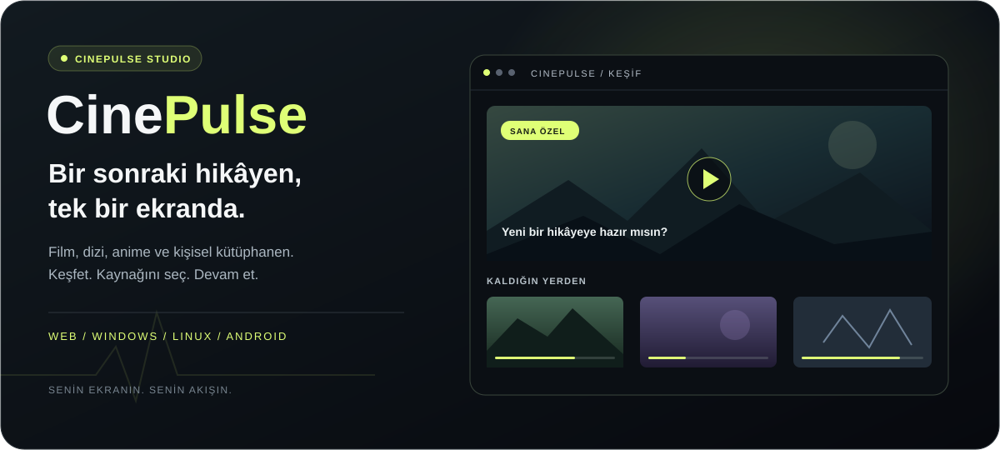

<div align="center">

<a href="https://cine-pulse-drab.vercel.app/">
  
</a>

### Keşfetmekten izlemeye. Tek bir akışta.

Film, dizi ve anime keşfi; kişisel listeler, kaldığın yerden devam etme ve uygulamada canlı TV.  
**CinePulse, izleme deneyimini kendi ekranında toplar.**

<a href="https://cine-pulse-drab.vercel.app/"></a>
&nbsp;
<a href="https://github.com/caca1403/cine-pulse/releases"></a>
&nbsp;
<a href="https://cine-pulse-drab.vercel.app/#showcase"></a>

**Web · Windows · Linux · Android**  
Güncel sürüm: **[v1.1.58](https://github.com/caca1403/cine-pulse/releases/tag/v1.1.58)**

[Özellikler](#cinepulse-ile-neler-yapabilirsin) · [Platformunu seç](#platformunu-seç) · [İlk kullanım](#i̇lk-kullanım) · [Sürüm yenilikleri](#v1157-ile-gelenler)

</div>

---

## İzleyeceğin şeyi bul. Deneyimini kendin seç.

CinePulse'un merkezinde içerik keşfi var. Ana sayfadaki önerilerden ilerle, bir yapımı ara veya kategorilere göz at. Detay ekranında konuyu, oyuncuları, sezonları ve bölümleri incele; ilgini çekenleri kişisel listene ekle.

Oynatıcıyı açtığında dil ve yayın seçenekleri aynı ekranda kalır. Dublaj ve altyazılı seçenekler ayrı listelenir; alternatifler sade, anonim adlarla gösterilir. Bir seçenek çalışmadığında listeden diğerine geçebilirsin. İzleme ilerlemen bu cihazda saklanır, sonraki gelişinde kaldığın yerden devam edebilirsin.

Koyu arayüz, neon yeşil vurgular ve sinema modu içeriği öne çıkarır. Masaüstünde detaylar ve bölüm listesi yan panelde durur; daha dar ekranlarda düzen ekran genişliğine uyum sağlar.

## CinePulse ile neler yapabilirsin?

| Deneyim | Seni ne bekliyor? |
| :--- | :--- |
| **İçerik keşfi** | Film, dizi, anime ve diğer kategoriler; arama, öneriler ve yapım detayları. |
| **Dizi takibi** | Sezon ve bölüm seçimi, bölüm bilgileri ve izleme ilerlemesi. |
| **Kendi kütüphanen** | Favoriler, izleme listesi, tamamlanan yapımlar ve devam ettiğin içerikler. |
| **Dil ve yayın seçimi** | Dublaj / altyazılı ayrımı; aynı yapım için mevcut alternatiflere tek menüden erişim. |
| **Oynatıcı kontrolleri** | Destekleyen yayınlarda ileri / geri sarma, hız, ses, altyazı, tam ekran ve sinema modu. |
| **Profil seçenekleri** | Ayrı profiller, profil özelleştirmesi ve çocuk profiline uygun içerik filtreleri. |
| **Trakt bağlantısı** | İsteğe bağlı hesap bağlantısıyla izleme geçmişi ve liste senkronizasyonu. |
| **Canlı TV** | Masaüstü ve Android uygulamasında kanal listeleri ile mevcut yayın akışı bilgileri. |
| **Android indirmeleri** | Desteklenen içerikleri indirip uygulamanın indirmeler / kütüphane bölümünden çevrimdışı açma. |
| **Masaüstü doğrulaması** | Doğrulama isteyen destekli yayınlarda uygulama içindeki tarayıcı alanını kullanma; tamamlandığında oynatıcıya dönüş. |

Yayınların erişilebilirliği ve kullanılabilen kontroller seçilen bağlantıya ve platforma göre değişebilir. Canlı TV web sürümünde kapalıdır; bunun için masaüstü veya Android uygulamasını seç.

## Platformunu seç

Kurulum yapmadan bakmak istersen **[siteyi aç](https://cine-pulse-drab.vercel.app/)**. Uygulama deneyimi için işletim sistemine uygun dosyayı **[GitHub Releases](https://github.com/caca1403/cine-pulse/releases)** üzerinden indir.

| Platform | Nasıl başlarsın? | İndirme / açılış |
| :--- | :--- | :--- |
| **Web** | Tarayıcıda aç; keşif, arama, listeler ve içerik detaylarından başla. | **[Siteyi aç](https://cine-pulse-drab.vercel.app/)** |
| **Windows** | EXE kurulum sihirbazını çalıştır; uygulamayı masaüstü veya Başlat menüsünden aç. | [v1.1.58 EXE](https://github.com/caca1403/cine-pulse/releases/download/v1.1.58/CinePulse-Setup-1.1.58.exe) |
| **Linux / DEB** | Debian / Ubuntu tabanlı sistemlerde DEB paketini paket yöneticinle kur. | [v1.1.58 DEB](https://github.com/caca1403/cine-pulse/releases/download/v1.1.58/CinePulse-1.1.58.deb) |
| **Linux / AppImage** | Dosyaya çalıştırma izni ver ve aç; sistemine göre AppImage desteği gerekebilir. | [v1.1.58 AppImage](https://github.com/caca1403/cine-pulse/releases/download/v1.1.58/CinePulse-1.1.58.AppImage) |
| **Android** | `cinepulse.apk` dosyasını indir, Android'in uygulama kurulum adımlarını tamamla. | [v1.1.58 APK](https://github.com/caca1403/cine-pulse/releases/download/v1.1.58/cinepulse.apk) |

**Dosyalar doğrudan indirilir; ZIP açman gerekmez.** EXE, DEB, AppImage ve APK sürüm sayfasında bulunur; bu depodaki ana dal uygulamanın kaynak kodunu içerir.

### Güncelleme nasıl çalışır?

Masaüstündeki güncelleme simgesi seni **[Releases listesine](https://github.com/caca1403/cine-pulse/releases)** götürür. Otomatik sürüm denetimi de daha yeni sürüm kodu yayımlandığında uygun platformun paketini önerir.

Windows'ta yeni EXE kurucusu mevcut kurulumun üzerine kurulur; Linux'ta kendi paket biçimini kullanmalısın. Android sürümleri aynı kalıcı release anahtarıyla imzalanır, böylece imzası eşleşen yeni APK mevcut uygulamayı güncelleyebilir. Aynı sürüm numarasıyla yenilenen paketler için dosyayı yeniden indirip kur.

## İlk kullanım

1. **Siteyi veya uygulamayı aç.** Tarayıcıda ilk açılış tanıtımından başlayabilir, **[tanıtımı tekrar görüntüleyebilirsin](https://cine-pulse-drab.vercel.app/#showcase)**.
2. **Bir yapım keşfet.** Arama yap veya ana sayfadaki kategorilerden ilerle. Dizilerde sezon ve bölümünü seç.
3. **Dilini ve yayınını seç.** Dublaj / altyazılı listesinde mevcut seçenekleri gör. Gerektiğinde başka bir alternatife geç.
4. **Kütüphaneni oluştur.** İlgini çekenleri listene ekle; izlemeye ara verdiğinde devam bölümünden geri dön.

## v1.1.58 ile gelenler

- **Eklenti yönetimi:** Ana menüden ve profil penceresinden açılan "Eklentiler" ekranı; 26 kaynağı arayabilir, açıp kapatabilirsin. Kapatılan kaynak hiç taranmaz, listede de görünmez.
- **Durum uyarıları:** Her eklenti satırında o kaynağın durumunu anlatan kısa bir not yer alır.
- **Yeni kaynak:** Film ve dizi araması genişletildi; yeni hat 1080p yayın sunuyor.
- **Yenilenen kaynak:** Daha hızlı çözümleme, doğrudan yayın bağlantısı ve Türkçe / İngilizce altyazı desteği.
- **Açılış düzeltmesi:** GPU sürücüsü çöken bilgisayarlarda uygulama kendiliğinden yazılım modunda yeniden başlar.
- **Tüm platformlar:** APK, DEB, EXE ve AppImage 1.1.58 sürümüyle, önceki sürümlerle aynı imza anahtarıyla yayımlandı.

**[Sürüm notlarını ve tüm dosyaları görüntüle →](https://github.com/caca1403/cine-pulse/releases/tag/v1.1.58)**

<details>
<summary><strong>Geliştirici olarak çalıştırmak istiyorum</strong></summary>

Node.js 20 veya daha yeni bir sürüm kullan. Bağımlılıkları kurup geliştirme sunucusunu başlat:

```bash
npm install
npm run dev
```

Masaüstü medya servisinin de gerekli olduğu geliştirmelerde ayrı bir terminalde:

```bash
npm run server
```

Windows, DEB ve AppImage paketlerini birlikte oluşturmak için:

```bash
npm run pack:all
```

Android'in release imzası GitHub Actions'taki kalıcı imzalama bilgilerini kullanır. Anahtar ve parolalar kaynak kodunda tutulmaz.

**Resmî site:** Vercel, bu public `caca1403/cine-pulse` deposunun `main` dalından dağıtım yapar.

</details>

---

## Kaynak kodu, kullanım ve izin

Proje, kaynak kodunun incelenebilmesi ve güvenlik ile geliştirme çalışmalarının izlenebilmesi için GitHub'da paylaşılmıştır. Ancak bir deponun herkese açık olması, kodu kullanma, değiştirme, dağıtma veya kendi hizmetinde yayımlama lisansı verildiği anlamına gelmez. Mevcut `LICENSE` dosyası **tüm hakların saklı olduğunu** belirtir; bu proje OSI onaylı bir açık kaynak lisansı altında sunulmuyor. Yeniden kullanım veya dağıtım için yazılı izin alın.

GitHub, herkese açık depoların görüntülenmesine ve GitHub üzerinden forklanmasına kendi hizmet koşulları çerçevesinde izin verir. Bu README, GitHub'ın fork özelliğini kapatamaz; daha önce oluşturulmuş forkları, klonları veya geçmiş commitleri de silemez.

Yazılı izinle özelleştirme ya da yeniden dağıtım yapılıyorsa, izin kapsamına uyun; türetilmiş çalışmayı resmî olmayan bir sürüm olarak belirtin, yaptığınız değişiklikleri ve tarihlerini açıklayın ve orijinal telif bildirimlerini koruyun. Değişiklikleri açıklamak izlenebilirliği artırır; tek başına zararlı kod eklenmesini teknik olarak önleyemez. Güvenlik için kodu inceleyin ve yalnızca resmî kanallardan yayımlanan sürümlere güvenin.

İzin talepleri için GitHub profili üzerinden proje sahibiyle iletişime geçin.

---

## Source code, use, and permission

CinePulse is shared on GitHub so its source can be inspected and its development and security reviewed. Public visibility alone does not grant a license to use, modify, distribute, or deploy the code. The current `LICENSE` reserves all rights; this project is **not offered under an OSI-approved open-source license**. Obtain written permission before reuse or distribution.

**Official production deployment:** Vercel deploys the `main` branch of this public `caca1403/cine-pulse` repository.

GitHub permits viewing and forking public repositories under its own terms of service. This README cannot disable GitHub's fork feature or remove existing forks, clones, or commit history.

If written permission allows customization or redistribution, follow its scope, identify the derivative as unofficial, describe the changes and their dates, and retain the original copyright notices. Disclosing changes improves traceability; it cannot technically prevent someone from adding harmful code. Review the source and trust releases only from official channels.

For permission requests, contact the project owner through the GitHub profile.
